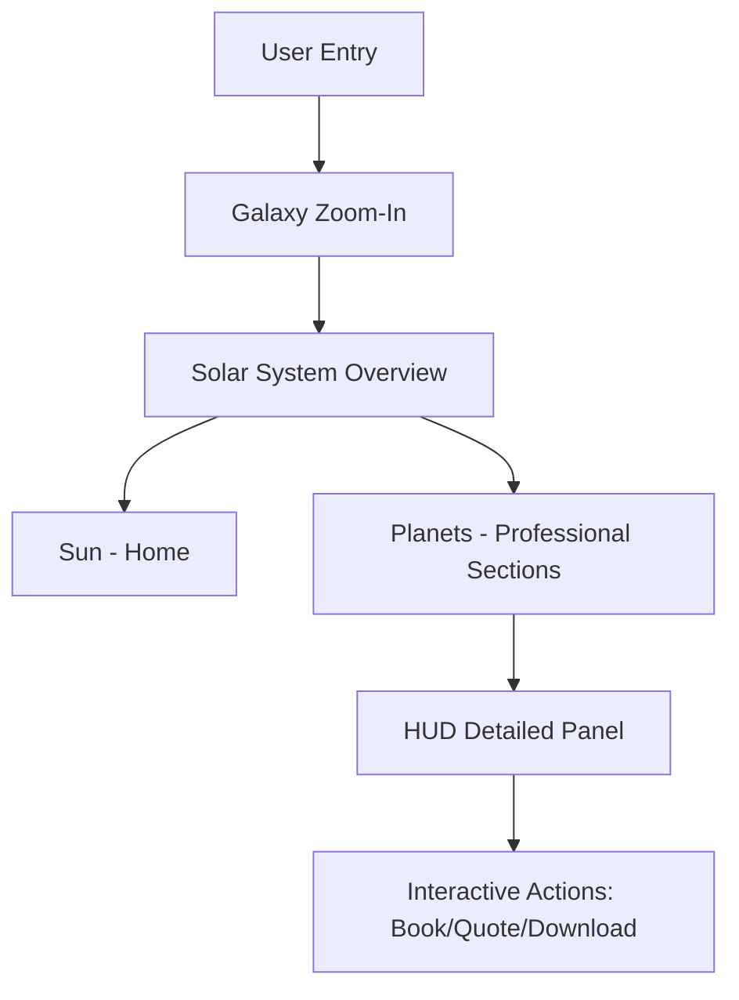

# 00_Master_Vision

## Purpose

The purpose of the **Solar Portfolio** is to establish an industry-defining, production-ready interactive portfolio website. It is designed to act as a primary branding and client-acquisition asset, demonstrating deep expertise in modern frontend engineering, web-based 3D graphics (WebGL/Three.js), and cinematic UI/UX. The core design concept is an immersive space exploration game that visitors navigate to discover the engineer's skills, experience, and projects.

## Goals

1. **Unforgettable First Impression:** Wow freelance clients, startup founders, and recruiters with a seamless, high-performance 3D environment.
2. **Kinetic Storytelling:** Structure professional information (Resume, Skills, Projects, Services) as celestial bodies that visitors explore, transforming a passive reading experience into an active adventure.
3. **Showcase Technical Mastery:** Demonstrate optimization skills by delivering high-fidelity 3D assets, complex camera paths, and custom shaders at a consistent 60 FPS on desktop and optimized mobile devices.
4. **Actionable Conversion:** Funnel visitors toward scheduling meetings, requesting quotes, or downloading resumes via integrated UI overlays.

## Architecture

The application is structured into two core layers:

1. **The Celestial Layer (3D Canvas):** Rendered using React Three Fiber (R3F), Three.js, and Drei. This contains the solar system, orbit lines, stars, dust particles, and planet meshes with custom shaders (e.g., Fresnel glows, heat distortion on the Sun).
2. **The Tactical Layer (2D HUD Overlay):** Rendered using React/Next.js and styled with Vanilla CSS and tailwind/shadcn. This contains the telemetry, data panels, forms, and navigation controls. It uses glassmorphism and ambient glows to blend into the space theme.

## Decisions

- **NASA Realism meets Sci-Fi Aesthetic:** We chose a clean, science-focused theme (NASA realism) combined with sleek Sci-Fi HUD elements. This avoids the chaotic neon overload of Cyberpunk while projecting precision, intelligence, and cutting-edge execution.
- **Canvas and HUD decoupling:** The WebGL canvas runs independently of the React DOM render cycle to prevent UI updates from stuttering the 3D animation loop.
- **Declarative Camera Control:** GSAP is selected for orchestrating camera movements (`position` and `target` vectors) to allow precise cinematic transitions between orbits.

## Tradeoffs

- **Visual Richness vs. Initial Load Time:** High-resolution planet textures (4K/8K) look spectacular but harm initial load times. _Mitigation:_ We use compressed 2K textures with procedural details (noise shaders) and progressive level-of-detail (LOD) swapping.
- **3D Interactivity vs. SEO/Accessibility:** A pure WebGL site cannot be crawled by search engines or read by screen readers. _Mitigation:_ We maintain a complete semantic HTML structure in the DOM that mirrors the state of the 3D scene, keeping it readable for crawlers and accessible via keyboard navigation.

## Future Expansion

- **Solar System Multi-Player:** Allow real-time visitors to appear as small orbiting space probes or ships in the solar system, displaying live statistics.
- **Interactive Project Simulator:** Integrate mini-simulations on project planets (e.g., a playable mock terminal, AI chat playground).
- **Autonomous AI Co-Pilot:** Add an AI navigator that verbally describes projects and answers questions about the creator's experience.

## Risks

- **WebGL Compatibility & Crashes:** Older devices or specific GPU drivers might fail to compile custom shaders. _Fallback:_ Provide a high-performance 2D Canvas / CSS fallback that keeps the same narrative flow without WebGL.
- **Asset Loading Bottleneck:** Large assets (models, audio, textures) can hang the loading screen. _Mitigation:_ Implement a chunked preload queue with service worker caching.

## Acceptance Criteria

- The app must load and render the base solar system within 3 seconds on standard 4G connections.
- Navigation between planets must execute smooth, stutter-free cinematic camera pans (maintaining 60 FPS on recommended hardware).
- The 2D HUD must adapt seamlessly to standard mobile screens, offering touch-friendly navigation without losing the spatial exploration narrative.

## Engineering Notes

- **Coordination Space:** Use standard WebGL units where the Sun is at `[0, 0, 0]`. Establish a clear scaling factor for planet distances to prevent clip-plane issues while preserving the relative feel of space travel.
- **Color Reference Palette:**
  - Space Black: `#020205`
  - Solar Orange: `#FF6B00` (Bloom/Emission)
  - Nebula Violet: `#6B00FF` (Soft ambient light)
  - Deep Space Blue: `#001C48` (Orbits/Glow)
  - HUD Teal: `#00F0FF` (Interactive UI)
