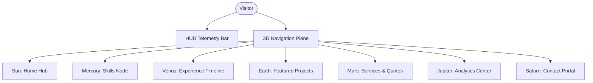

# 01_Product_Requirements(PRD)

## Purpose

The Product Requirements Document (PRD) defines the specific scope, target audience, feature requirements, and product design guidelines for the **Solar Portfolio**. It serves as the single source of truth for the product team to evaluate feature completeness and design fidelity.

## Goals

1. **Maximize User Engagement:** Retain visitors on the portfolio through interactive elements, spatial storytelling, and gamified animations.
2. **Drive Conversions:** Convert passive visitors into prospective clients (freelancers/SaaS), startup co-founders, or employers using strategic Call-to-Action (CTA) elements.
3. **Capture Detailed Analytics:** Enable data-driven insights on visitor behaviors, downloads, and inquiry conversion rates.

## Architecture

From a product perspective, the Solar Portfolio behaves as a single-page application (SPA) with virtual routes mapped to planets. The UI layout consists of three primary components:

1. **Interactive Canvas (3D Viewport):** Displays the background space flight animations, starfield, Sun, and planets.
2. **System HUD (Global Navigation):** Fixed panel on the edges of the screen containing global actions: volume controls, sound toggles, page selection indicators, analytics dashboard toggle, and download resume CTA.
3. **Information Terminals (Dynamic Overlays):** Interactive panels that open when a user reaches a planet. They render project grids, skills diagrams, timeline trackers, contact/quote forms, or meeting schedulers.

## Decisions

- **Priority-Based User Journeys:** Freelance clients are the highest priority. Therefore, the "Services" and "Request Quote" CTAs must be prominent and instantly reachable. Developers and recruiters are addressed via detailed experience timelines, Github heatmap, and clean code documentation references.
- **Ambient Soundscapes:** An atmospheric sound system is included to increase engagement. Visitors must explicitly opt-in or out during the initial loader, ensuring compliance with browser audio playback policies.
- **Unified Analytics Node:** The visitor analytics dashboard is built directly into the space universe (e.g. as a telescope console or a dedicated planet) to make tracking data a transparent and gamified feature.

## Tradeoffs

- **Deep Immersion vs. Friction:** Interactive transitions and camera travel paths create delays when jumping between sections. _Mitigation:_ We implement a "Quick Warp" command console (search bar / traditional navigation dropdown) in the HUD that allows instant warping directly to the target information, bypassing 3D travel paths for returning users.
- **Postponed Blog and AI Integrations:** V1 will not contain a live blog or an interactive AI assistant. _Mitigation:_ We will display these as "Inactive Satellite Stations" or "Orbiting Probes (Coming Soon)" inside the 3D viewport, generating anticipation while allowing the database and API models to reserve schema hooks for them.

## Future Expansion

- **AI Consultant integration:** In V2, add a floating AI probe that reads the page contents and acts as an autonomous sales agent for freelance work.
- **Dynamic Blog Feed:** Render MDX blog files as research logs found inside space wrecks or satellites.

## Risks

- **Visitor Bounce due to Loading Screens:** If the galaxy asset bundle takes more than 5 seconds to load, visitors will leave. _Mitigation:_ Use a lightweight 3D wireframe or progressive canvas loading. The PRD specifies that basic text sections must load and be readable even if WebGL assets are still pre-fetching.

## Acceptance Criteria

1. **Target Persona Conversions:** The "Book Meeting" button triggers a Calendly/Cal.com embed, and "Request Quote" opens a multi-step dynamic cost estimator.
2. **Analytics Telemetry:** Track and persist: sessions, planet visits, download clicks, quote submissions, average session duration, geographic region (country), device type, and referral channel.
3. **Core Features Checklist:**
   - **Sun (Home Node):** Brief bio, high-level pitch, profile visualization.
   - **Skills Node:** Interactive tech-stack constellation.
   - **Projects Node:** Filtering system (SaaS, Web3, Mobile, Tools) with links to code and live demos.
   - **Services Node:** Detailed cards for Landing Pages, Dashboards, SaaS, AI Integration, Automation, Maintenance, and Consultation.
   - **Experience/Education Node:** Interactive vertical resume timeline with expand/collapse details.
   - **GitHub Heatmap:** Integration displaying live contribution history.
   - **Contact Form Node:** Resend email integration with Zod schema validation.

## Engineering Notes

- **Analytics Storage:** Analytics must be stored in Supabase with a custom IP-to-Country API check (using Cloudflare GeoIP headers).
- **Audio Format:** Ambient background sound should loop seamlessly. Deliver audio in compressed WebM (`.webm`) and MP3 (`.mp3`) formats.
