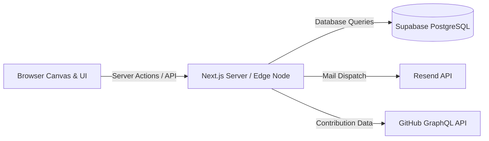

# 02_Software_Requirements(SRS)

## Purpose

The Software Requirements Specification (SRS) establishes the quantitative and qualitative requirements for the **Solar Portfolio** software system. It defines functional behaviors, performance thresholds, security baselines, and cross-platform compatibility metrics for development.

## Goals

1. **Performance Standards:** Maintain steady 60 FPS rendering under standard desktop browser workloads.
2. **Robust Input Validation:** Guarantee 100% clean data sanitization for all input fields (Contact Form, Quote Request) to protect backend services.
3. **Data Security & Privacy:** Implement secure database permissions and access control layers using Supabase Row Level Security (RLS).
4. **Resiliency:** Handle API and asset load failures gracefully without system crashes.

## Architecture

The system will run on a serverless Next.js architecture, utilizing static generation for SEO-critical paths, client-side React Three Fiber (R3F) for WebGL execution, and serverless Edge functions for API handling.

## Decisions

- **TypeScript Strict Mode:** Mandatory configuration to enforce compile-time safety and prevent runtime pointer errors in complex 3D math and state transformations.
- **Supabase Row Level Security (RLS):** All database tables must block write actions except through authorized Server Actions. Analytical reads will be exposed through strict RLS policies bound to user sessions.
- **Edge Runtime for Analytics API:** Analytics logging API routes will use the Next.js Edge Runtime to minimize cold-start latency and speed up response times.

## Tradeoffs

- **Prisma vs. Direct Supabase JS Client:** Prisma is excellent for schema migrations but adds bundle size and database connection overhead in serverless environments. _Decision:_ We will use **direct Supabase JS client and SQL migrations** for runtime queries, and reserve Prisma or clean pg-typed SQL models only for local validation, optimizing for absolute minimum serverless execution overhead.
- **Static Site Generation (SSG) vs. Server-Side Rendering (SSR):** R3F needs client-side execution. Dynamic data (visitor counts, Github statistics) requires fresh values. _Decision:_ We will use **Incremental Static Regeneration (ISR)** for the main pages and fetch telemetry/live data client-side (SWR / React Query pattern) to keep the initial load statically pre-rendered.

## Future Expansion

- **OAuth Authentication:** Future integration hooks in Supabase Auth to allow clients to sign in and view real-time project progress reports.
- **WebRTC Multi-visitor sync:** Coordinate multiple sessions using custom Supabase Realtime channels.

## Risks

- **CPU and GPU Thermal Throttling:** Prolonged 3D rendering can overheat mobile devices and drain battery. _Mitigation:_ Implement canvas suspension (pausing R3F loops) when the tab is hidden or when the user is reading long-form text documents on a planet overlay.
- **Rate-Limit Exhaustion:** Malicious spamming of the contact/quote APIs. _Mitigation:_ Integrate Cloudflare Turnstile verification and implement token-bucket rate limiting via Vercel Edge middleware.

## Acceptance Criteria

### Performance Targets (Core Web Vitals)

- **First Contentful Paint (FCP):** < 1.0s.
- **Largest Contentful Paint (LCP):** < 1.8s.
- **Interaction to Next Paint (INP):** < 100ms.
- **Cumulative Layout Shift (CLS):** < 0.05.
- **R3F Rendering Loop:** Constant 60 FPS on Apple M1 or Intel i5 (integrated GPU) at 1080p, 30+ FPS on iPhone 12 / Samsung S20.

### Functional Requirements

- **Contact Form Validation:** Reject SQL injections, HTML scripts, and empty payloads. Validate email structure using Zod schemas.
- **Rate Limits:** Restrict contact form submissions to 3 per IP per hour.
- **Data Layer Protection:** Supabase API key must be restricted to public client permissions, with database write tables configured for RLS.

## Engineering Notes

- **Strict ESLint Rules:** Configure custom rules preventing use of `any` type, requiring explicit return types on utility functions, and banning console logs in production builds.
- **Browser Compatibility Matrix:** Support Chrome 90+, Safari 14+, Firefox 88+, Edge 90+, Chrome/Safari Mobile.
