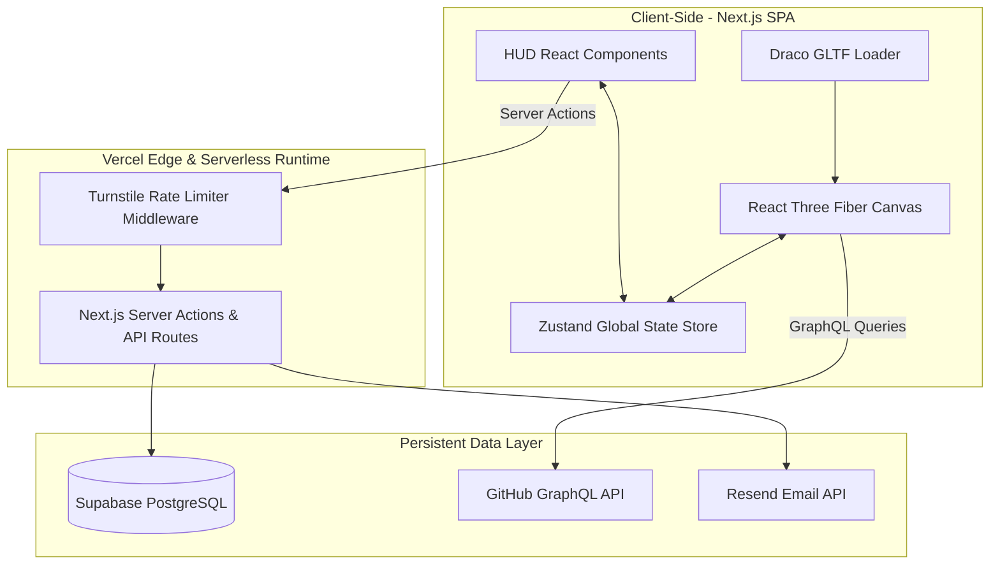

# 05_System_Architecture

## Purpose

The System Architecture document outlines the end-to-end technical structure of the **Solar Portfolio**. It details data pipelines, engine integrations, rendering systems, caching behaviors, and states, providing developers with a blueprint for system interaction.

## Goals

1. **Performance Decoupling:** Keep high-intensity 3D rendering loops independent of regular DOM updates.
2. **Minimized Server Overhead:** Achieve maximum static asset delivery with zero-downtime serverless integrations.
3. **Data Pipeline Consistency:** Streamline data updates from Supabase to client HUD widgets.
4. **Developer Efficiency:** Standardize on state and API protocols to simplify local testing and debugging.

## Architecture

The application runs on a split architecture consisting of three main layers: **Client Context (DOM & WebGL)**, **Serverless API / Middleware Layer**, and **Database / External APIs**.

### Data Flow Lifecycles

- **Initial Page Load:** Next.js serves pre-rendered HTML/CSS skeleton. Client browser downloads assets (compressed GLB models, texture sheets) via CDN, parsed by a custom Draco-decoded Loader.
- **Navigation Transition:** Clicking a HUD link updates the Zustand store (`activePlanet`). GSAP intercepts this change, coordinates camera Bezier paths in the 3D Canvas, and fires an event to slide in the React panel.
- **Form Action Submission:** User submits a form. React Hook Form validates data. Next.js Server Action is invoked, running under an Edge rate-limiter. The server writes to Supabase and dispatches an email notification via Resend.

## Decisions

- **Zustand for State Management:** Unlike Redux, Zustand is extremely lightweight, uses hooks, and allows subscribing to state changes without causing re-renders. This is crucial for passing state changes (like camera speed or target vector coordinates) directly into the R3F `useFrame` loop without triggering DOM layout recalculations.
- **Supabase for Database:** Supabase is selected for its PostgreSQL foundation, zero-config Row Level Security, instant REST APIs, and simple connection setup in serverless functions.
- **Draco Mesh Compression:** 3D GLTF models are compressed using Google's Draco library. This reduces model sizes by up to 90% (e.g. from 12MB down to 1.2MB), which is essential for fast mobile loading.

## Tradeoffs

- **Server Actions vs. Standard REST API Routes:** Server Actions are highly integrated into Next.js and secure by default, but they are React-specific. _Decision:_ Use Server Actions for all direct client-to-server operations (contact form, quotes) to minimize route handler boilerplates. Use Standard API Routes (`/api/telemetry`) for public-facing or webhook endpoints to enable future integrations (e.g. tracking scripts).
- **Supabase Client vs. Direct SQL Pool:** Directly querying Supabase REST APIs via fetch is faster than using an ORM like Prisma in cold environments. _Decision:_ We use standard JavaScript SDK hooks (`@supabase/supabase-js`) for dynamic operations and plain SQL migration scripts, keeping our serverless packages small.

## Future Expansion

- **Distributed VPS Deployment:** If we move away from Vercel later, the system is designed to run in Docker container environments. The Next.js app compiles to a standalone Node server that connects to a managed PostgreSQL cluster.
- **GraphQL Proxy:** Introduce an Apollo Client or Urql wrapper in Next.js to aggregate GitHub, Dev.to, and local database feeds under a unified query schema.

## Risks

- **Vercel Serverless Cold Starts:** If the API endpoints go cold, forms might hang. _Mitigation:_ Deploy critical paths (like forms and analytics telemetry) onto the Next.js Edge Runtime, which has zero cold starts.
- **WebGL Context Loss:** If the user minimizes the tab or puts the computer to sleep, the WebGL context might collapse, leaving a blank canvas. _Mitigation:_ Listen for the `webglcontextlost` event and gracefully re-instantiate the R3F Canvas component.

## Acceptance Criteria

- The app compiles successfully via `next build` using strict TypeScript checks.
- 3D loaders parse GLB assets asynchronously without blocking UI interactions.
- Database connections are pooled efficiently, ensuring serverless instances do not exceed Supabase concurrent connection limits.

## Engineering Notes

- **Caching Strategy:** Statically pre-rendered routes use ISR with a revalidation time of 3600 seconds (`revalidate = 3600`) to fetch fresh GitHub and telemetry stats without spamming external APIs on every click.
- **Asset CDN Headers:** Ensure `.glb`, `.png`, and `.mp3` assets in the public folder are served with cache control header `Cache-Control: public, max-age=31536000, immutable`.
