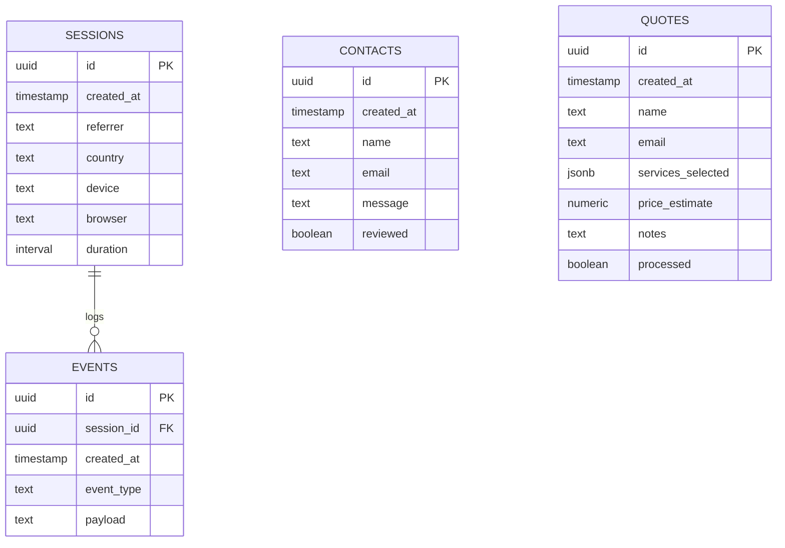

# 12_Database_Architecture

## Purpose

The Database Architecture document defines the database tables, entity relationships, indexes, security rules, and migration pipelines for the **Solar Portfolio**. It establishes a scalable PostgreSQL layout managed via Supabase.

## Goals

1. **Accurate Telemetry Storage:** Capture and persist detailed visitor analytics without database performance degradation.
2. **Secure Access Controls:** Enforce strict read/write security profiles using PostgreSQL Row Level Security (RLS).
3. **Optimized Queries:** Speed up analytics lookups using index structures.

## Architecture

The system is built on Supabase PostgreSQL, exposing direct REST APIs for client-side analytics tracking, and using server-side security checks for contact entries and quote calculations.



## Decisions

### 1. Database Table Blueprints

#### Table: `contacts`

- **Purpose:** Stores inquiries submitted via the contact form node.
- **Fields:**
  - `id`: `uuid` | Primary Key | Default: `gen_random_uuid()`
  - `created_at`: `timestamp with time zone` | Default: `now()`
  - `name`: `text` | Not Null
  - `email`: `text` | Not Null
  - `message`: `text` | Not Null
  - `reviewed`: `boolean` | Default: `false`

#### Table: `quotes`

- **Purpose:** Stores project budget estimation structures submitted from the services panel.
- **Fields:**
  - `id`: `uuid` | Primary Key
  - `created_at`: `timestamp with time zone` | Default: `now()`
  - `name`: `text` | Not Null
  - `email`: `text` | Not Null
  - `services_selected`: `jsonb` | Not Null (Stores package options dynamically)
  - `price_estimate`: `numeric(10,2)` | Not Null
  - `notes`: `text`

#### Table: `analytics_sessions`

- **Purpose:** Tracks unique visitor connection profiles.
- **Fields:**
  - `id`: `uuid` | Primary Key | Default: `gen_random_uuid()`
  - `created_at`: `timestamp with time zone` | Default: `now()`
  - `referrer`: `text`
  - `country`: `varchar(3)` (ISO country code)
  - `device`: `text` (Mobile / Tablet / Desktop)
  - `browser`: `text`

#### Table: `analytics_events`

- **Purpose:** Tracks specific user interaction signals (downloads, warps, books).
- **Fields:**
  - `id`: `uuid` | Primary Key
  - `session_id`: `uuid` | Foreign Key referencing `analytics_sessions(id)` ON DELETE CASCADE
  - `created_at`: `timestamp with time zone` | Default: `now()`
  - `event_type`: `text` (e.g. `resume_download`, `planet_warp`, `cal_opened`)
  - `payload`: `jsonb` (Contextual metrics like planet identifier)

### 2. Index Structures

To optimize analytical dashboard queries, we configure index mappings:

- **Composite Index on Events:** `CREATE INDEX idx_events_session_type ON analytics_events(session_id, event_type);`
- **Index on Session Origin:** `CREATE INDEX idx_sessions_country ON analytics_sessions(country, created_at DESC);`

### 3. Security (Row Level Security)

- **Contacts & Quotes:** Enforce `ALTER TABLE contacts ENABLE ROW LEVEL SECURITY;`. Establish an insert-only policy allowing public write access (`INSERT`), but locking read access (`SELECT`) strictly to database administrator profiles (using the service role key).
- **Analytics Sessions & Events:** Insert-only policies bound to active sessions, preventing visitors from editing or deleting log entries.

## Tradeoffs

- **Relational DB vs. Time-Series DB (e.g. TimescaleDB):** Time-series databases scale better for telemetry tracking. _Decision:_ PostgreSQL is more than capable of handling portfolio traffic scales (tens of thousands of visits/month) without needing dedicated clusters, keeping setup and maintenance costs low.

## Future Expansion

- **Blog Tables (`posts`, `comments`):** Schema structures reserved to hold blog content and user comments, ready for V2.
- **AI Chat Telemetry (`ai_conversations`, `ai_messages`):** Tables to log interactions with the future AI space assistant.

## Risks

- **Table Bloat via Spam Inserts:** Malicious agents can flood database tables with fake sessions or forms. _Mitigation:_ In addition to application layer rate limits, configure PostgreSQL triggers that rate-limit inserts per IP range using a custom PL/pgSQL wrapper.

## Acceptance Criteria

- SQL schemas compile successfully inside the Supabase editor.
- RLS tests verify that public API queries to read `contacts` or `quotes` are rejected.
- Session foreign key constraints delete all associated event records on session removal.

## Engineering Notes

- **Initial SQL Migration Script Blueprint (`supabase/migrations/20260707000000_init.sql` outline):**

```sql
-- Enable UUID extension
create extension if not exists "uuid-ossp";

-- Create Contacts Table
create table public.contacts (
    id uuid default gen_random_uuid() primary key,
    created_at timestamp with time zone default timezone('utc'::text, now()) not null,
    name text not null,
    email text not null,
    message text not null,
    reviewed boolean default false not null
);

-- Enable RLS
alter table public.contacts enable row level security;

-- Policy: Allow anonymous insertions
create policy "Allow anonymous contact insertion"
    on public.contacts for insert
    with check (true);

-- Policy: Lock reads to service role only
create policy "Restrict read access to admin"
    on public.contacts for select
    using (auth.role() = 'service_role');
```
