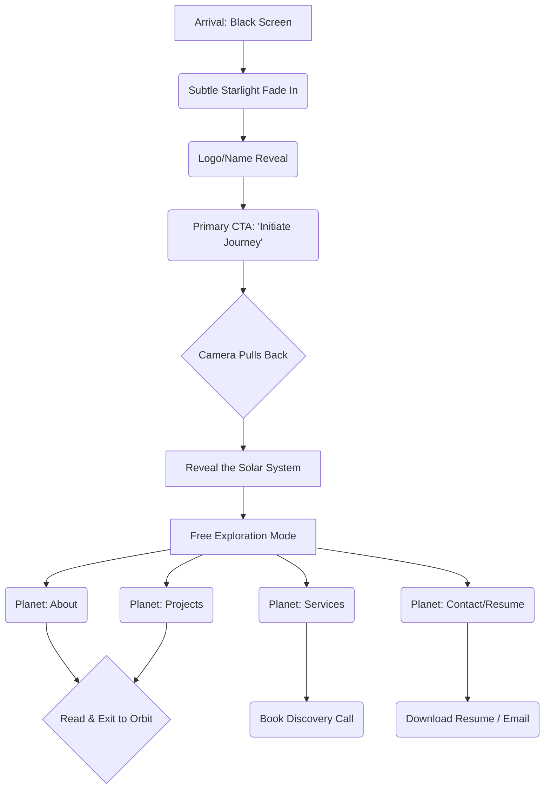

# Portfolio Experience & User Journey

## 1. Primary Directives

The portfolio is an interactive cosmic journey designed to achieve highly specific professional outcomes:

1. **Impress Recruiters & Hiring Managers:** Secure interviews through immediate proof of high-tier engineering and design capabilities.
2. **Win Freelance Clients:** Convert high-value founders by demonstrating premium execution, taste, and structured processes.
3. **Showcase Technical Mastery:** Prove that complex React Three Fiber / WebGL logic can be executed flawlessly and performantly.
4. **Tell a Story:** Guide the visitor through a deliberate narrative of exploration, rather than dumping information.

---

## 2. Target Personas & Optimal Journeys

### 👩‍💼 The Recruiter (The 60-Second Path)

- **Mindset:** Stressed, scanning hundreds of resumes, incredibly low attention span.
- **Goal:** Find out if the candidate has the right tech stack and years of experience.
- **Experience Flow:**
  1. _Arrival:_ Blown away by the initial 3D load (hooks attention).
  2. _Immediate Escape Hatch:_ A prominent, non-obtrusive "View Resume" button is immediately available without exploring the 3D space.
  3. _Journey:_ If they click "Experience," they are flown directly to a highly readable, timeline-based summary.
- **Emotion:** "This candidate is exceptionally talented and respects my time."

### 🚀 The Startup Founder / Client

- **Mindset:** Looking for an A-player who understands product, design, and business value.
- **Goal:** Determine if this developer can build premium, scalable products.
- **Experience Flow:**
  1. _Journey:_ Explores the "Projects" planet to see case studies.
  2. _Deep Dive:_ Navigates to the "Services" planet.
  3. _Action:_ Reads the structured Process and Pricing philosophy.
  4. _Conversion:_ Clicks "Book Discovery Call" via a polished calendar integration.
- **Emotion:** "This is exactly the premium quality my product needs. I trust them."

### 💻 The Technical Interviewer / Peer

- **Mindset:** Skeptical, analytical. Looking for clean code and solid architecture.
- **Goal:** Verify the candidate's actual coding ability beyond visuals.
- **Experience Flow:**
  1. _Journey:_ Clicks the "GitHub" or "Architecture" planet.
  2. _Action:_ Explores deep links to source code, reads the custom `docs/` folder, and analyzes performance metrics.
- **Emotion:** "They don't just use libraries; they understand fundamental architecture."

---

## 3. The Grand Visitor Journey (Flow Diagram)

---

## 4. The Solar System (Planet Order & Psychology)

Planets are ordered by orbital distance, representing the narrative arc.

### ☀️ The Sun (Center): Home / Identity

- **Purpose:** The anchor of the experience.
- **Visual Mood:** Blindingly warm, pure energy.
- **Emotion:** Awe, raw power.

### 🌍 Planet 1 (Inner Orbit): About & Experience

- **Purpose:** Establish trust and humanity.
- **Content:** Who I am, my history, my timeline of roles.
- **Visual Mood:** Earth-like, hospitable, familiar (Blues, greens, clouds).
- **Emotion:** Trust, comfort, reliability.

### 🪐 Planet 2 (Mid Orbit): Projects & Work

- **Purpose:** Provide undeniable proof of skill.
- **Content:** Premium case studies, GitHub links, architecture diagrams.
- **Visual Mood:** Gas giant with massive, beautiful rings. Structurally complex.
- **Emotion:** Curiosity, wonder, respect for the craftsmanship.

### 🌑 Planet 3 (Outer Orbit): Services & Freelance

- **Purpose:** Pitching high-end freelance services to founders.
- **Content:** What I build, process breakdown, pricing philosophy, booking CTA.
- **Visual Mood:** Sleek, dark, metallic moon. Extremely modern and professional.
- **Emotion:** Confidence, exclusivity, premium value.

### ☄️ The Comet/Anomaly: Contact & Resume

- **Purpose:** Hard conversion.
- **Content:** Email form, Cal.com embed, 1-click PDF resume download.
- **Visual Mood:** High contrast, pulsing energy.
- **Emotion:** Urgency, clarity, action.

---

## 5. Micro-Interactions, Haptics & Mobile

- **Onboarding (The First Interaction):** Users might not realize the 3D space is interactive. Upon arrival, a subtle, pulsing `[ Drag to Explore ]` or `[ Swipe to Rotate ]` hint appears and fades away the moment the first input is registered.
- **Hover (Orbit Mode - Desktop):** Hovering a planet slightly slows its rotation and brings up a minimalist, floating HUD label (e.g., `SEC // 02: PROJECTS`).
- **Touch (Orbit Mode - Mobile):** Since hover does not exist on touch devices, a single tap acts as a "Focus/Preview" (bringing up the label and slightly centering the planet). A second tap or a dedicated "Enter" button triggers the travel sequence.
- **Click/Tap (Travel):** The camera eases into a 2.5-second cinematic flight path. Sound (future) is a low, rising hum.
- **Landing (Arrival):** As the camera locks into the planet's atmospheric orbit, the HTML/glass UI fades in elegantly from the bottom up.
- **Buttons:** Hovering a CTA causes a fluid 1.02x scale and brightens the text. Clicking provides a satisfying, instant visual snap.

---

## 6. Conversion Strategy & Social Proof

Every path leads to a conversion. The portfolio is not a museum; it is a funnel.

- **Global Escape Hatch:** A persistent, minimal `Resume` and `Contact` button always available in the top right corner.
- **At-a-Glance Stack:** The initial home screen must feature a subtle, scannable strip of core technologies (React, Three.js, Node) so recruiters don't even need to click to see the tech stack.
- **In-Content CTAs:**
  - After reading the _About_ section: "View My Projects ->"
  - After viewing a _Project_: "View Source Code" or "Let's Build Yours ->"
  - At the bottom of _Services_: "Book a Discovery Call"
- **Social Proof (The Missing Link):** The Services/Freelance planet must feature a "Testimonials / Client Success" section. High-value clients require proof of reliability before booking a call.
- **Frictionless Contact:** Forms must be minimal. A direct `mailto:` link, quick "Copy Email" micro-interaction, or a 1-click Cal.com modal is superior to a massive 10-field contact form.

---

## 7. Performance & Accessibility (The Invisible UX)

- **Screen Reader DOM Fallback:** A 3D WebGL `<canvas>` is inherently invisible to screen readers. The canvas must be marked `aria-hidden="true"`, while a visually hidden, semantically structured HTML version of the entire portfolio exists underneath for screen readers to parse instantly.
- **Graceful Fallbacks:** If the WebGL context crashes or fails to load, a pure CSS/HTML fallback version of the portfolio automatically renders.
- **Low-End Mobile:** Blur filters are disabled, device pixel ratio is capped at 1.0, and cinematic camera flights are converted into fast, 0.5-second crossfades.
- **Keyboard Navigation:** Crucial for developers and accessibility. `Tab` focuses through planets (moving the camera slightly), and `Enter` flies to them. The UI is fully trap-managed.
- **Motion Sickness:** Respecting `prefers-reduced-motion` bypasses 3D flights entirely.

---

## 8. Anti-Patterns (What We Will NEVER Do)

1. **Never Hijack the Scroll:** Traditional "scrolljacking" breaks user expectation. We use dragging/swiping for 3D navigation, but once inside a UI panel, standard native vertical scrolling applies.
2. **Never Autoplay Audio:** Music/SFX is strictly opt-in via a sleek toggle in the corner.
3. **Never Hide the Exit:** Users must always know how to "Go Back to Orbit." A clear, persistent "Return" button is required inside every planet section.
4. **Never Trap the Recruiter:** The 3D experience must be a _bonus_, not a _barrier_. If someone just wants a PDF resume, they must be able to get it in 1 click from the landing page.
5. **Never Use Loading Spinners In-Game:** Initial load is fine. But once in the solar system, transitioning between planets must be seamless. Preload all assets.
